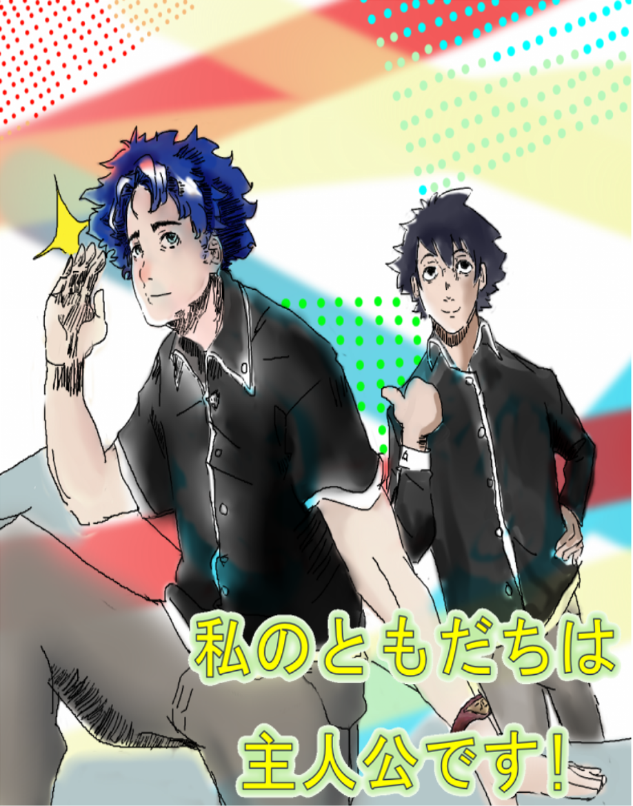

## My Best Friend Is The Main Character

A collaboration with my friend [aihara_art]( https://www.instagram.com/aihara_art/?hl=en) inspired by the group work in IASC 1F01. This class has helped me gain confidence in my leadership and team skills, and so I agreed to this collaboration and plan to see it through to the very end.

### What is it?

This is a manga idea I had a long time ago but lacked the confidence or skill level to pull off. Now, together with Aihara I will be working as the author and he will be working as the illustrator.
### Coverpage Concept art



## Plot Summery
```markdown
The story is about two high school friends and their daily life. Yamamoto Yuudai is always late for school, and sometimes his gets him in trouble. But he also has a secret, when monsters attack his city he can transform into an amazing hero thanks to secret and mysterious powers. He tries to blend in, but his crazy blue hair and green eyes seem to attract every girl in school except his crush. His best friend Himura Kiyoshi is just an average high schooler. He has no special powers, and gets average grades, but he does have one special thing about him - he is the protagonist.
```
### Interested?
If the idea of this story sounds interesting, you can support my friend and his art [HERE]( https://www.patreon.com/AiharaDrinksTea), both of us would appreciate it! And thank you again to Aihara for the collaboration.
